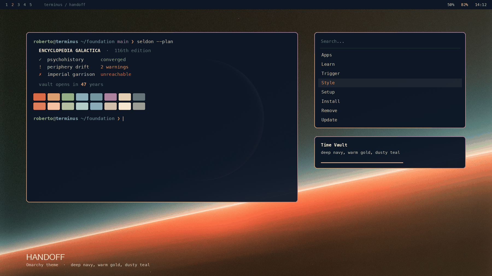

# Terminus

Deep navy base, warm gold accent, dusty teal secondaries.

The immensity of space is the last frontier of the natural world, and it has
made people dream and build for as long as there have been people to look up
at it.

It did that to me early. What I remember most are summer nights back home,
lying out under a sky full of stars and wondering what was really out at those
distant bright points — and whether the light was telling me the truth. It
takes so long to reach us that whatever sent it may be long gone.

This theme is a tribute to those nights, when my mind fell into step with
everything around it and simply ran. I want that feeling back every time I sit
down at Omarchy: the pull to make something, and to lose track of the hours
building, experimenting and learning my way through this remarkable operating
system.



*Mock-up, not a screenshot — see [PREVIEW.md](PREVIEW.md).*

The palette was sampled from *Foundation* promotional artwork and then corrected for terminal legibility. The name is Terminus, the planet at the edge of the galaxy where the Foundation begins — a beginning rather than a decline, and a pun a terminal theme has earned.

## Install

```bash
omarchy theme install https://github.com/r-bart/omarchy-terminus-theme.git
omarchy theme set terminus
```

Or use *Install > Style > Theme* in the Omarchy menu, then pick **Terminus** under
*Style > Theme* (`Super + Ctrl + Shift + Space`).

Requires Omarchy 4. The palette uses the semantic key set, which does not exist
in 2.x.

## Palette

| Key | Value |
|-----|-------|
| `accent` | `#d9a862` |
| `background` | `#0c1626` |
| `lighter_background` | `#17243a` |
| `foreground` | `#d8cbb4` |
| `bright_foreground` | `#f2e8d5` |
| `selection` | `#26364e` |
| `muted` | `#5e6e87` |

Window borders come from `hyprland_active_border`, which Hyprland and every
shell card share.

### Contrast

WCAG relative luminance, against both surfaces a theme renders text on.
`lighter_background` is where tooltips, floats, status lines and Neovim's
`NormalFloat` sit — the surface most palettes forget to check.

| | on `background` | on `lighter_background` |
|---|---|---|
| `foreground` | 11.33 | 9.72 |
| `bright_foreground` | 14.92 | 12.80 |
| `accent` | 8.40 | 7.21 |
| `green` | 7.84 | 6.73 |
| `cyan` | 6.99 | 5.99 |
| `blue` | 5.66 | 4.86 |
| `magenta` | 5.47 | 4.69 |
| `red` | 5.26 | 4.52 |
| `muted` | 3.50 | 3.00 |

Every chromatic clears 4.5:1 on both. Body text clears 10:1.

## What it ships

`colors.toml`, `icons.theme` and `backgrounds/`. Nothing in this repository
runs on your machine: no `neovim.lua`, no terminal config, no `vscode.json`,
no `shell.toml`.

That is a choice, not a constraint. A theme *can* ship those files, and
Omarchy will use them: `omarchy-theme-set` copies the whole theme directory
into the staging area, and `omarchy-theme-set-templates` only renders a
template when the output file does not already exist, so anything the theme
ships wins over the generated version. Leaving them out is what makes the
entire desktop fall out of the palette, window borders included, and keeps
this theme picking up shell improvements on each Omarchy release instead of
pinning a snapshot.

This theme used to ship `shell.toml`, `neovim.lua` and `vscode.json`. All
three were removed, because a pinned file does not just freeze a design, it
overrides the machine:

- `shell.toml` pinned four `[spacing]` tokens. A pinned spacing token is
  returned raw by `Style.spacingToken`, bypassing `space()` — so it never
  scales with `[font] base-size`. Anyone who had raised their font in
  `~/.config/omarchy/shell.toml` got the larger type with padding frozen at
  the values chosen for `base-size = 12`: `panel-padding` 10 instead of 24 at
  base-size 16. The snapshot had also drifted, missing `normal-border`,
  `hover-cursor-border` and `focus-border`, and flattening
  `active-border-foreground` to a solid colour where the template now uses the
  gradient.
- `vscode.json` declared the extension `omarchy.terminus`, which does not
  exist. With a descriptor present `omarchy-theme-set-vscode` takes the branch
  that installs a third-party extension and writes
  `workbench.colorTheme = "Terminus"`, skipping the branch that installs the
  extension generated from this palette. VS Code ended up pointed at a theme
  that was never there.
- `neovim.lua` replaced the generated one. The generated file is built from
  this same `colors.toml`, so the hand-written copy bought nothing and only
  went stale.

`hyprland-extra.lua` is documentation, not a theme file. It is installed with
the rest of the directory and then never read, because Omarchy loads no
Hyprland config from a theme — see [Window metrics](#window-metrics).

## Backgrounds

Five, cycled with `Super + Ctrl + Space`. The same five ship with every theme
in this set; only the order differs. Omarchy picks the first in sort order,
unless the background you were already on shares its filename with one of
these — then it advances to the next, because `omarchy-theme-set` cycles from
the current entry.

| File | Scene |
|------|-------|
| `1-crescent.jpg` **(default)** | Crescent over a planet’s limb, orange atmosphere. The upper-left is nearly empty, so windows land on black. |
| `2-gate.jpg` | Monolith with a vertical seam of light, a crescent in the upper left. The seam is near-white and dead centre, where the menu opens. |
| `3-dune.jpg` | Risograph halftone dune. High contrast centre-left; best at full window opacity. |
| `4-flow.jpg` | Cosmic flow, warm filaments. Same caveat as the dune. |
| `5-arch.jpg` | A lit concrete shell on a frozen shore under a vast crescent planet. Everything bright sits in the lower third; the sky above is flat, so windows land clean. |

JPEG, not WebP. Omarchy's shell is Quickshell, and a stock Omarchy 4 install
has no Qt WebP decoder — `qt6-imageformats` is not a dependency of `omarchy`
or `quickshell`, and none of the 22 built-in themes ship a `.webp` background.
A WebP wallpaper is selected happily by `omarchy-theme-set` and then fails at
`Error decoding: ... Unsupported image format`, leaving a black desktop, a
blank tile in the theme switcher and blank thumbnails in the background picker.

Encoded at 2912×1632, quality 95, baseline, with no chroma subsampling. Full
chroma matters here. Every scene sets a saturated warm edge against a cold
field, and 4:2:0 softens that edge. macOS `sips` writes 4:4:4 only at quality
100, which triples the file for no visible gain. These were built with
`cjpeg -quality 95 -sample 1x1 -optimize`.

Add your own in `~/.config/omarchy/backgrounds/terminus/` — they appear alongside
these.

## Window metrics

Not part of the theme. Omarchy never reads a Hyprland config from a theme
directory; the only thing a theme sends the compositor is
`hyprland_active_border`. To match the design, paste `hyprland-extra.lua` into
`~/.config/hypr/looknfeel.lua`.

Omarchy 4 configures Hyprland in **Lua**, not `.conf`, and there is no
`~/.config/hypr/hyprland.conf`. Corner rounding is a machine-level setting that
each person picks for themselves in `~/.config/hypr/looknfeel.lua`, not
something a theme has any say in. Omarchy ships `0`; this palette is agnostic
either way.

Worth knowing if you change it: the shell mirrors Hyprland's
`decoration:rounding` into its own card corners, so rounding your windows also
rounds the menu, launcher, notifications and tooltips. And it only re-reads
that value on startup, on a theme change, and on the
`omarchy toggle window-gaps` flag — a hand-edited `looknfeel.lua` plus
`hyprctl reload` rounds the windows while the shell keeps the old radius until
you re-apply a theme or restart it.

## The rest of the set

Five themes off one set of wallpapers, each a different answer to which axis
is the ground and which is the signal.

| Theme | |
|-------|--|
| [Periphery](https://github.com/r-bart/omarchy-periphery-theme) | Cold governs; amber only warns. |
| [Vault](https://github.com/r-bart/omarchy-vault-theme) | Sodium light on stone. |
| [Starsend](https://github.com/r-bart/omarchy-starsend-theme) | One signal against the dark. |
| [Dawn](https://github.com/r-bart/omarchy-dawn-theme) | The sky above the vault, not the vault. |

## License

MIT. See [LICENSE](LICENSE).
